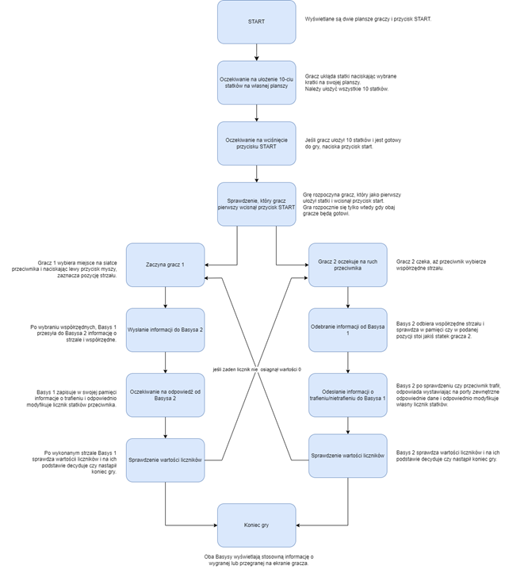
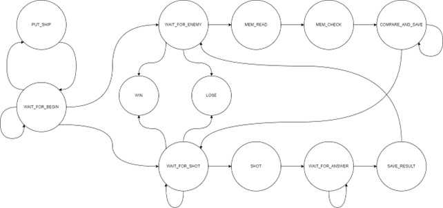
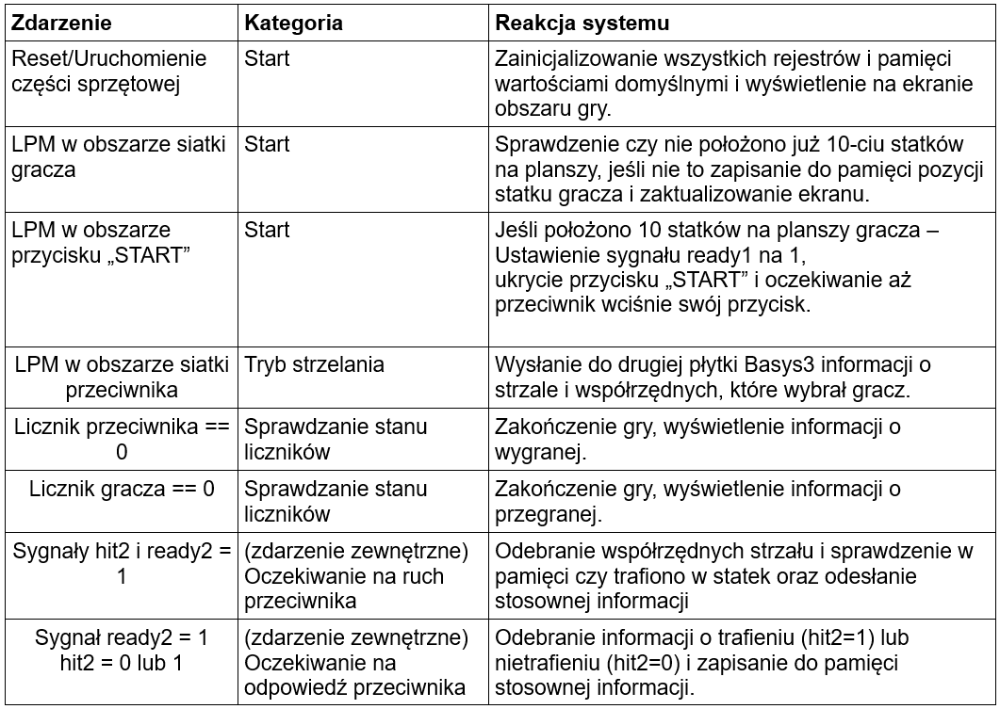
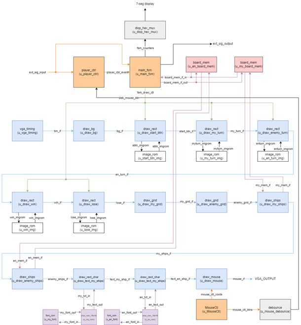
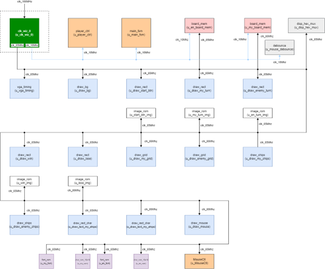
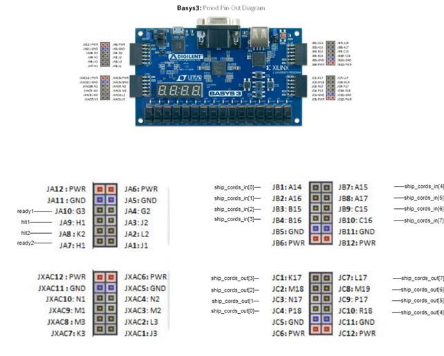

# FPGA_WARSHIPS
Repozytorium na potrzeby zajęć projektowych z przedmiotu Układy Elektroniki Cyfrowej 2 - MTM semestr 4 - 2023

1. [Documentation](/doc/)
2. [RTL Files](/rtl/)
3. [Simulations](/sim/)
4. [HW Files](/fpga/)
5. [Confluence docs](https://fpgastatki2023.atlassian.net/wiki/spaces/SD/overview)

# Film prezentujący działanie projektu

Link do ściągnięcia filmu:
https://drive.google.com/file/d/1rVNI9s45F6EAzhemcrMdzVRFoP97SPt7/view?fbclid=IwAR0IS4A-FiI_scan8XzZXFUsKb1IXHHvWTCnxh2fVmMAdyZFzxZ7nU2PVcU
   
# Opis projektu
Pomysł na statki FPGA narodził się jako odpowiedź na liczne oszustwa w tej popularnej grze, w wersji vivado wszystkie trafienia są odpowiednio oznakowane, nie ma też żadnych wątpliwości na temat historii trafień gdyż ta jest przechowywana do samego końca. 

# Specyfikacja

## Ogólny opis algorytmu

Gra rozpoczyna się od ułożenia przez każdego z graczy dziesięciu statków na własnej planszy. Podczas układania statków gracz może obserwować pozostałą ilość do położenia, na wyświetlaczu. Po zakończeniu układania gracz wciska przycisk „START” (gracz, który jako pierwszy wciśnie przycisk – rozpoczyna jako pierwszy). Rozpoczynający gracz wybiera z obszaru siatki przeciwnika pole, w które chce strzelić i wciska LPM. Po wykonanym ruchu układy Basys3 zapisują odpowiednie informacje i na ekranach wyświetlają się odpowiednie kolory pól, w zależności czy statek został trafiony czy też nie. W trakcie całej gry gracz może obserwować stan liczników statków na wbudowanym wyświetlaczu 7-segmentowym swojego Basyska. Po osiągnięciu przez jeden z liczników wartości równej zero, gra informuje o wygranej i przegranej odpowiednich graczy, przez wyświetlenie stosownej informacji na ekranie  – Koniec gry.

Komunikacja obu układów oparta jest na dwóch równoległych magistralach 8-bitowych służących jako wyjście i wejście adresu siatki. Dodatkowo użyto 4 sygnałów sterujących ready1, hit1 jako wyjścia oraz ready2, hit2 jako wejścia. Sygnały sterujące służą do sygnalizowania gotowości układu i akcji strzału. Oba układy Basys3 są połączone „symetrycznie” – hit1-hit2, ready1-ready2 itd.
Komunikacja i cały algorytm jest w pełni „symetryczny” – oba układy Basys3 mają wgrany ten sam program, jedyną różnicą są stany w jakich się znajdują w danej chwili.
Kolory pól:
- zielony   –   mój statek
- niebieski –   nietrafiony statek
- biały     –   puste pole
- czerwony  –   trafiony statek

Główny algorytm gry można również przedstawić przy pomocy uproszczonego diagramu głównej maszyny stanów.

## Tabela zdarzeń

Opis zdarzeń występujących podczas działania programu/urządzenia, zarówno zewnętrznych (interakcje z użytkownikiem), jak i wewnętrznych (specyficzne stany w algorytmie). Zdarzenia podzielone są na kategorie dotyczący różnych stanów działania programu.

# Architektura

## Moduł Top

Moduł top składa się z głównego toru VGA odpowiedzialnego za generowanie sygnałów dla monitora. Tor VGA odczytuje z dwóch bloków pamięci informacje o siatkach graczy (czy dane pole jest puste, trafione, nietrafione itd.). Do modułów pamięci dane są zapisywane i odczytywane przez główną maszynę stanów main_FSM. Maszyna stanów pełni funkcję głównej logiki sterującej, wspomaganej przez moduł player_ctrl, który ma za zadanie monitorować działania użytkownika (sprawdzanie pozycji myszy i interakcji obiektów). Dodatkowo moduł top wyposażono w blok obsługujący wyświetlacz 7-segmentowy na którym wyświetlane są wartości liczników gracza i przeciwnika (liczniki są integralną częścią maszyny stanów).

### Schemat blokowy

### Rozprowadzenie sygnału zegara

W projekcie zastosowano dwie częstotliwości zegara, wygenerowane w module clk_wiz_0. Częstotliwość 65MHz odpowiada za obsługę toru VGA oraz wyświetlacza 7-segmentowego. Częstotliwość 10MHz obsługuje główną maszynę stanów, pozostałą logikę sterującą oraz komunikację z drugim układem basys3.

## Schemat połączeń układu Basys3

Obie płytki są połączone zgodnymi sygnałami tj. read1 (Basys1)  ready2 (Basys2), 
hit1 (Basys1)  hit2 (Basys2),    ship_cords_in (Basys1)  ship_cords_out (Basys2) itd.

